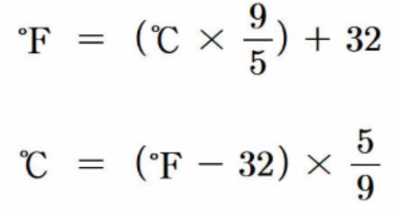

**Temperature conversion**

In this task, we will implement the 'celsiusToFahrenheit', 'FahrenheitToCelsius' and the 'main' function

 - **float CelsiusToFahrenheit (float)** : A function that takes a Celsius temperature as input and returns the equivalent Fahrenheit temperature.
 - **float FahrenheitToCelsius(float)** : A function that takes a Fahrenheit temperature as input and returns the equivalent Celsius temperature.
 - The following is the conversion formula


<example 1>  
input :
```
Enter the Celsius temperature
3
Enter the ​Fahrenheit temperature
37.4
```
output :
```
3 degrees Celsius is equivalent to 37.4 degrees Fahrenheit
37.4 degrees Fahrenheit is equivalent to 3 degrees Celsius
```

<example 2>  
input :
```
Enter the Celsius temperature
5.5
Enter the ​Fahrenheit temperature
51
```
output :
```
5.5 degrees Celsius is equivalent to 41.9 degrees Fahrenheit
51 degrees Fahrenheit is equivalent to 10.5556 degrees Celsius
```

