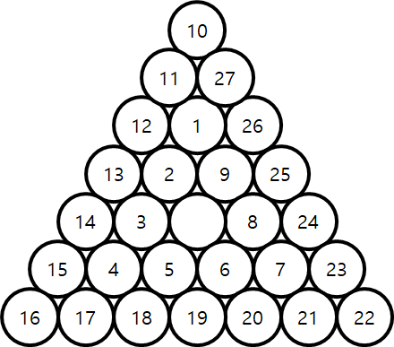

### Number at Top corner of i-th Triangle

Balls with positive integers written on them are arranged in a specific order according to the following rules:
1. Place the ball without a number at the center.
2. Balls with positive integers are arranged counterclockwise in the shape of an equilateral triangle.
3. When one triangular layer is completely filled, the next layer is filled in the same way.



If the top corner number of the first layer is 1,

<span style="font-weight: bold; text-decoration: underline;">
implement the function int TopCorner(int) to calculate the top corner number of the i-th triangular layer.
</span>


<br><br>
<span style="color: #f00">
※ Do not modify the main function. Points will be deducted if modified.
</span>


&lt;example 1&gt;  
input:
```
1
```

output:
```
1
```


&lt;example 2&gt;  
input:
```
3
```

output:
```
28
```