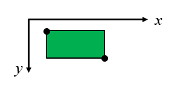

# shape conversion_1

There are three classes : Point, Shape, Rectangle.
1. **Class Point**  
   Define a one 2D point.
2. **Class Shape (parent class)**  
   This is common interface for various 2D shapes (rectangle, triangle...etc)
   Shape class have pure virtual function that affect child class to have same name of method.
3. **Class Rectangle (child class)**  
   Rectangle class is defined by inheriting Shape class.  
   A rectangle can be represented with two points.

- the location of the point with right-angle & relative position of the remaining two points (offset)  

**Implement the following functions** in rectangle.cpp
Detailed specifications are given in the comment of rectangle.hpp header file.

| Function                                 | Descriptions                                                                                                                                                                                                             |
|------------------------------------------|--------------------------------------------------------------------------------------------------------------------------------------------------------------------------------------------------------------------------|
| **bool Shift(int delta_x, int delta_y)** | Move the shape by delta_x on the x-axis and by delta_y on the y-axis. After movement, if any of the four vertices of the shape have a negative number, the movement of the shape must be rejected and false is returned. |
| **bool DoubleSize()**                    | After fixing the point in the upper left corner, double the height and width.                                                                                                                                            |
| **bool Rotate()**                        | Rotate 90 degrees counterclockwise based on the point in the upper left corner.                                                                                                                                          |

